# ACP Handoff 插件图解手册

> 本文件用 Mermaid 图从多个维度可视化 acp-handoff 插件的核心原理。
> 配合 DEEP_DIVE.md 阅读效果最佳。

---

## 目录

1. [问题起点：没有插件时的信息断层](#1-问题起点没有插件时的信息断层)
2. [插件介入后：完整系统架构](#2-插件介入后完整系统架构)
3. [三大事件钩子的时序关系](#3-三大事件钩子的时序关系)
4. [llm_input 快照捕获流程](#4-llm_input-快照捕获流程)
5. [before_tool_call 上下文注入决策树](#5-before_tool_call-上下文注入决策树)
6. [同步模式（sync-return）完整时序](#6-同步模式sync-return完整时序)
7. [异步模式（async-callback）完整时序](#7-异步模式async-callback完整时序)
8. [Cron 场景：为什么普通 acpoff 失效](#8-cron-场景为什么普通-acpoff-失效)
9. [Cron 场景：cron-acp skill 修复路径](#9-cron-场景cron-acp-skill-修复路径)
10. [sessionKey 续接状态机](#10-sessionkey-续接状态机)
11. [maxTurns 轮次控制流程](#11-maxturns-轮次控制流程)
12. [首轮 vs 续接轮：task 内容对比](#12-首轮-vs-续接轮task-内容对比)
13. [handoff_payload 的构成结构](#13-handoff_payload-的构成结构)
14. [Discord 回调目标解析路径](#14-discord-回调目标解析路径)
15. [startBackgroundMonitor 后台监听流程](#15-startbackgroundmonitor-后台监听流程)
16. [数据存储全景图](#16-数据存储全景图)
17. [skill-builder-hourly-v2 端到端完整流程](#17-skill-builder-hourly-v2-端到端完整流程)

---

## 1. 问题起点：没有插件时的信息断层

没有 `acp-handoff` 时，父 Agent 派发子任务的信息极度贫乏：

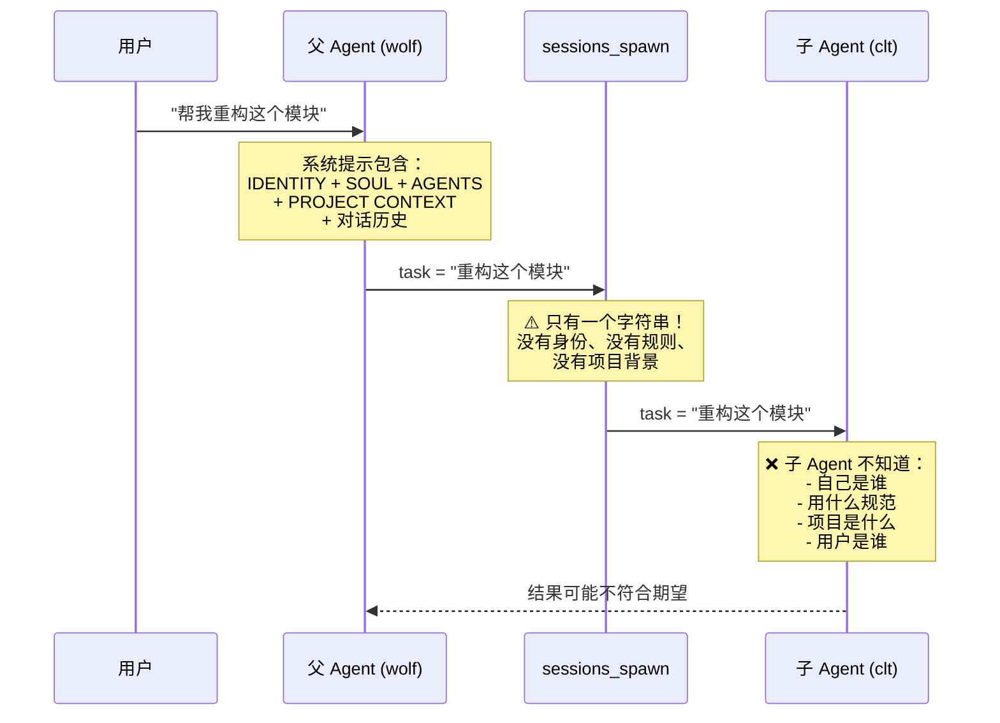

---

## 2. 插件介入后：完整系统架构

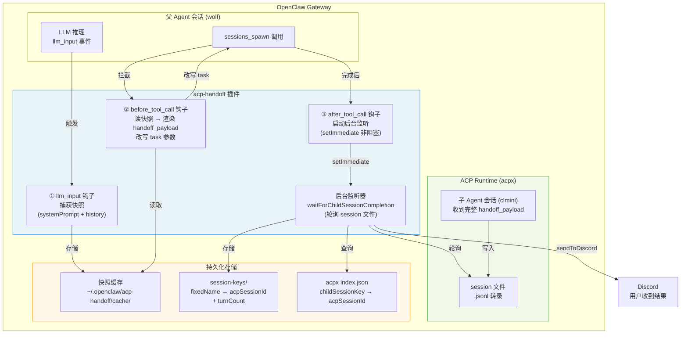

---

## 3. 三大事件钩子的时序关系

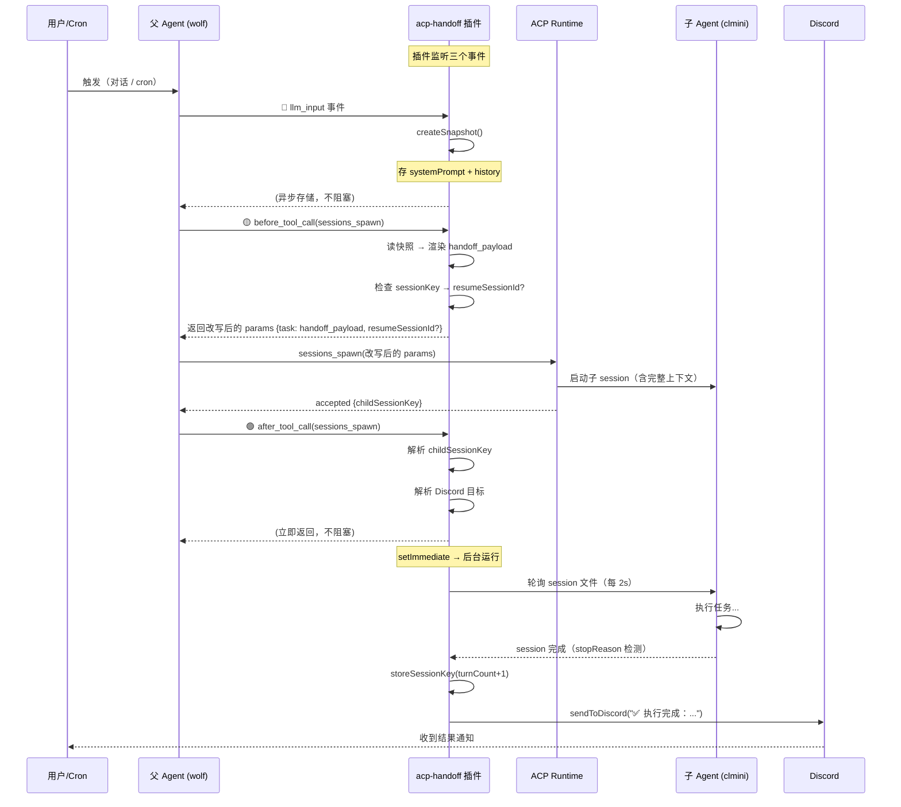

---

## 4. llm_input 快照捕获流程

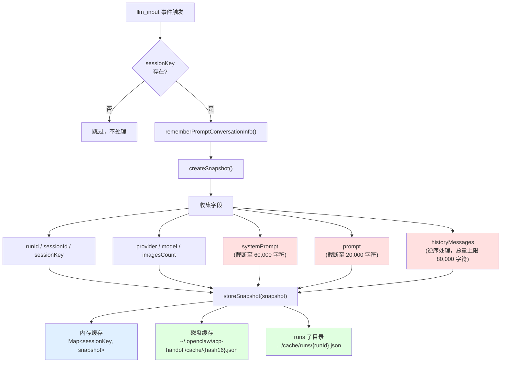

**快照大小限制（防止 token 超限）**：

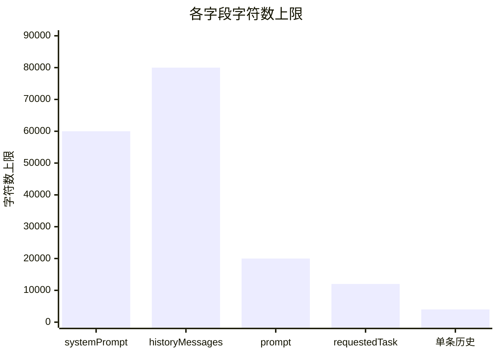

---

## 5. before_tool_call 上下文注入决策树

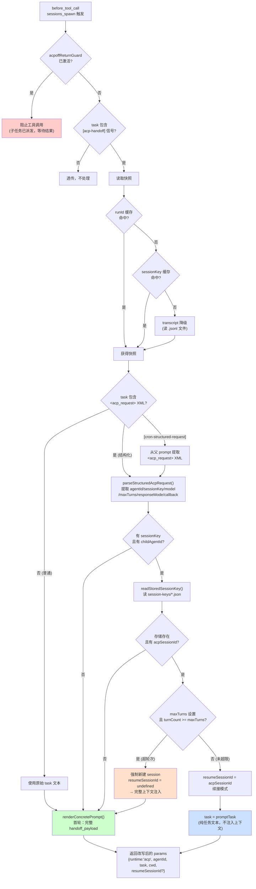

---

## 6. 同步模式（sync-return）完整时序

`responseMode=sync-return`：父 Agent 等待子任务完成，结果直接在对话中返回。

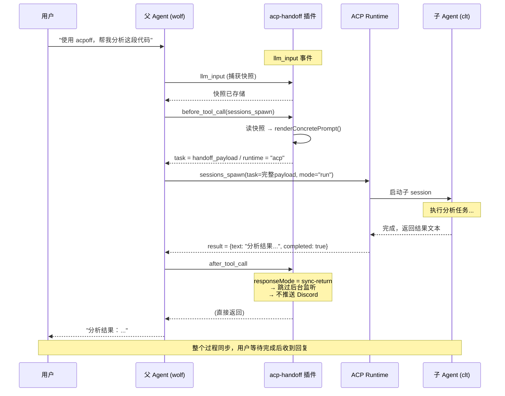

---

## 7. 异步模式（async-callback）完整时序

`responseMode=async-callback`：父 Agent 立即返回，子任务在后台执行，完成后推送 Discord。

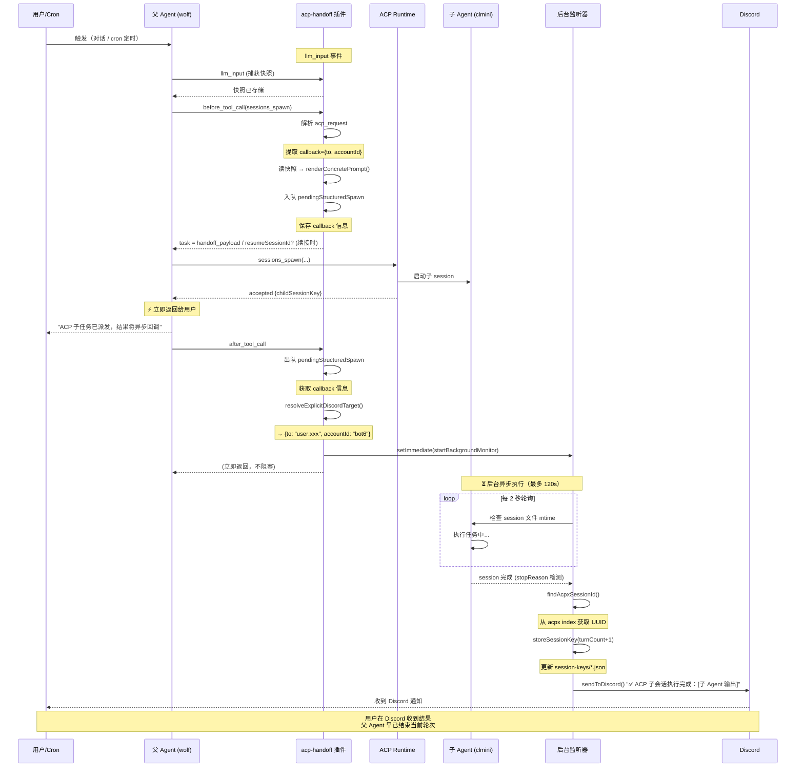

---

## 8. Cron 场景：为什么普通 acpoff 失效

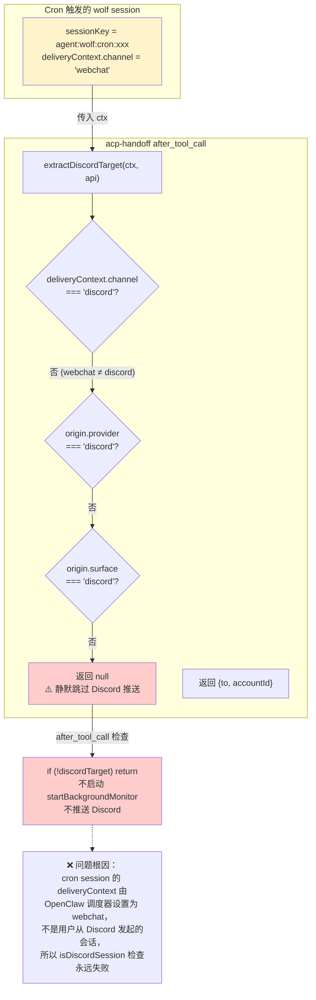

---

## 9. Cron 场景：cron-acp skill 修复路径

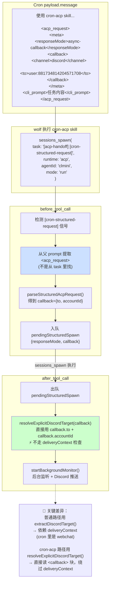

---

## 10. sessionKey 续接状态机

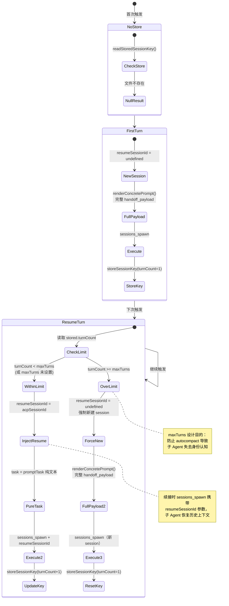

---

## 11. maxTurns 轮次控制流程

以 `maxTurns=3` 为例：

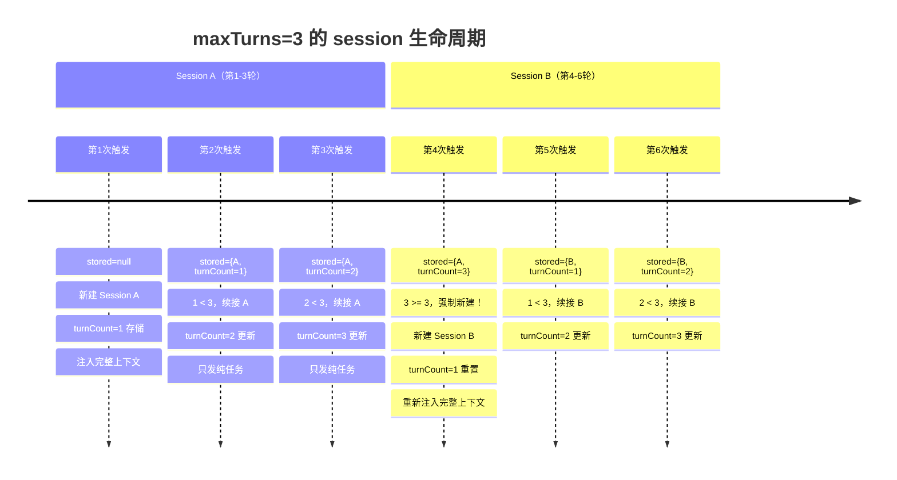

**turnCount 计算逻辑**：

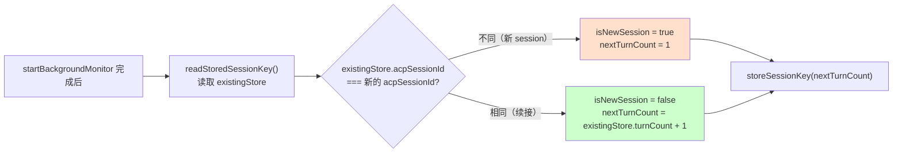

---

## 12. 首轮 vs 续接轮：task 内容对比

```mermaid
block-beta
    columns 2

    block:FIRST["首轮（无 resumeSessionId）"]:1
        F1["&lt;handoff_payload&gt;"]
        F2["  &lt;handoff_context&gt;"]
        F3["    IDENTITY.md 内容"]
        F4["    SOUL.md 内容"]
        F5["    AGENTS.md 内容"]
        F6["    TOOLS.md 内容"]
        F7["    USER.md 内容"]
        F8["    MEMORY.md 内容"]
        F9["  &lt;/handoff_context&gt;"]
        F10["  &lt;handoff_task&gt;"]
        F11["    用户的实际任务"]
        F12["  &lt;/handoff_task&gt;"]
        F13["&lt;/handoff_payload&gt;"]
    end

    block:RESUME["续接轮（有 resumeSessionId）"]:1
        R1["用户的实际任务"]
        R2["（纯文本，无任何包装）"]
        SPACE1[" "]
        SPACE2[" "]
        SPACE3[" "]
        SPACE4[" "]
        SPACE5[" "]
        SPACE6[" "]
        SPACE7[" "]
        SPACE8[" "]
        SPACE9[" "]
        SPACE10[" "]
        SPACE11[" "]
    end
```

**为什么续接轮不注入上下文？**

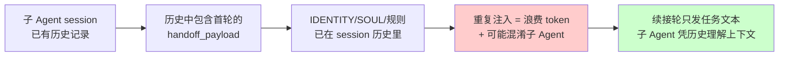

---

## 13. handoff_payload 的构成结构

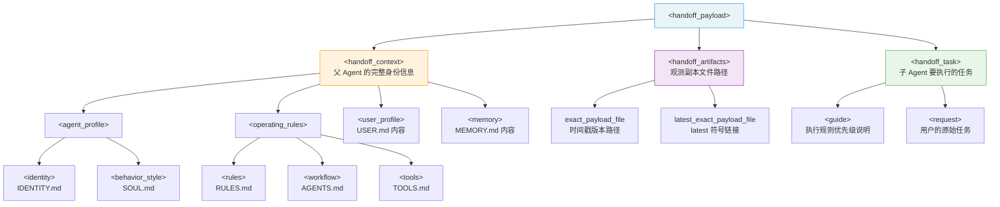

**Project Context 提取规则**：

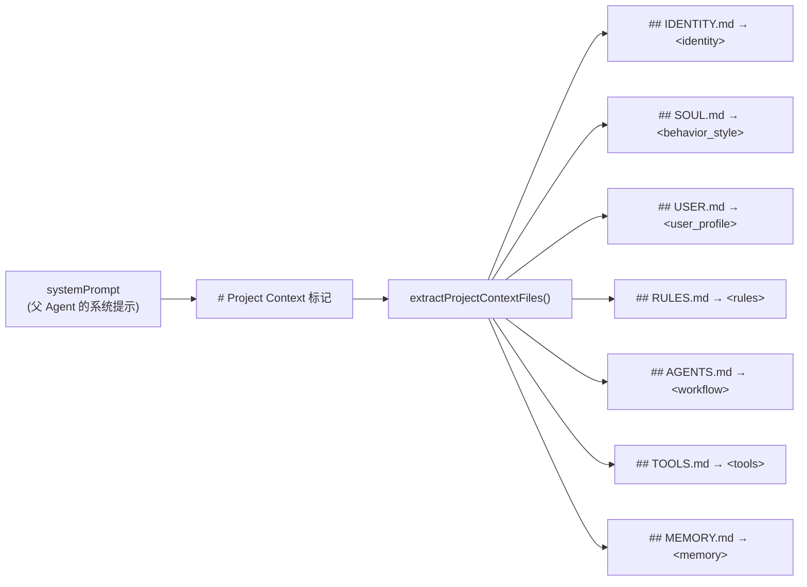

---

## 14. Discord 回调目标解析路径

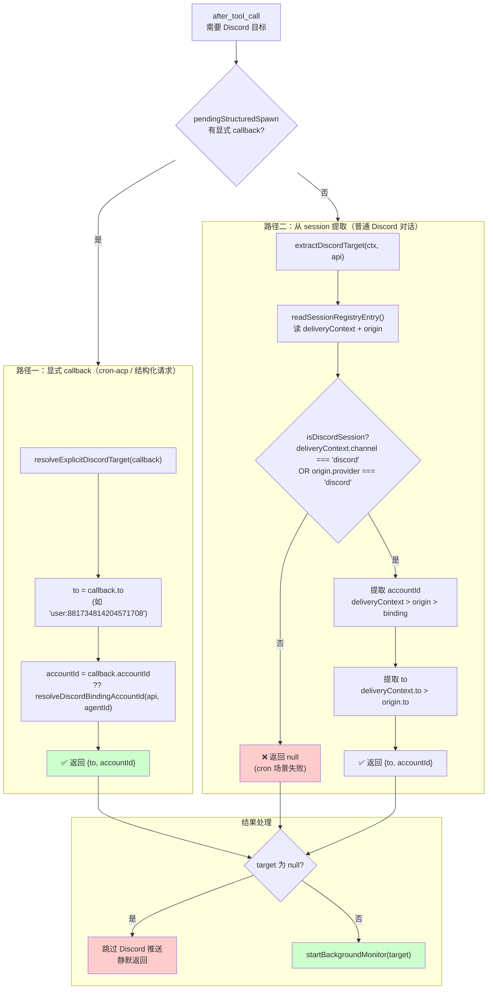

---

## 15. startBackgroundMonitor 后台监听流程

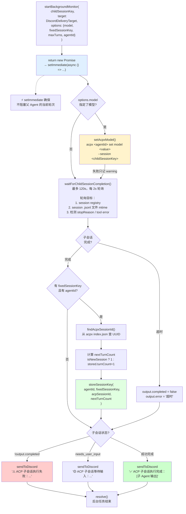

---

## 16. 数据存储全景图

```mermaid
graph TB
    subgraph OPENCLAW["~/.openclaw/"]
        subgraph AHP["acp-handoff/"]
            CACHE["cache/<br/>  {hash16}.json       ← 按 sessionKey 的最新快照<br/>  runs/{runId}.json   ← 按 runId 的历史快照"]
            SK["session-keys/<br/>  {agentId}-{fixedName}.json<br/>  字段：acpSessionId, turnCount,<br/>        agentId, fixedName, storedAt"]
        end

        subgraph AGENTS["agents/{agentId}/"]
            SESS_REG["sessions/sessions.json<br/>  会话注册表<br/>  含 deliveryContext, origin"]
            SESS_FILE["sessions/{sessionId}.jsonl<br/>  会话完整转录<br/>  (waitForChildSessionCompletion 轮询此文件)"]
        end

        subgraph WS["workspace-{agentId}/"]
            ACPX_IDX[".acpx/sessions/index.json<br/>  entries: [{name: childSessionKey,<br/>             acpSessionId: uuid}]<br/>  (findAcpxSessionId 读取此文件)"]
        end
    end

    subgraph WORKDIR["工作目录/{workspaceDir}/"]
        subgraph DOTOC[".openclaw/acp-handoff/"]
            PROMPT_TS["2026-03-20T12-34-56-clmini.prompt.txt<br/>  时间戳版本 handoff_payload 副本"]
            PROMPT_LATEST["latest-observed-cli-payload.txt<br/>  最新 handoff_payload 副本"]
            ACP_REQ["latest-observed-acp-request.xml<br/>  最新 &lt;acp_request&gt; 副本（调试用）"]
            CB_MIRROR["latest-resolved-callback.json<br/>  最新 Discord 目标（调试用）"]
            PENDING["pending-structured-spawns.json<br/>  待处理的结构化请求队列<br/>  (after_tool_call 从此恢复)"]
        end
    end

    subgraph FLOW["数据流向"]
        direction LR
        E1["llm_input"] -->|"写"| CACHE
        E2["before_tool_call"] -->|"读"| CACHE
        E2 -->|"读"| SK
        E2 -->|"写"| PENDING
        E2 -->|"写"| PROMPT_TS
        E2 -->|"写"| PROMPT_LATEST
        E3["after_tool_call"] -->|"读"| PENDING
        E4["startBackgroundMonitor"] -->|"读"| ACPX_IDX
        E4 -->|"写"| SK
        E4 -->|"轮询"| SESS_FILE
        E4 -->|"读"| SESS_REG
    end

    style AHP fill:#fff3e0
    style AGENTS fill:#e8f5e9
    style WS fill:#e3f2fd
    style DOTOC fill:#f3e5f5
```

---

## 17. skill-builder-hourly-v2 端到端完整流程

```mermaid
sequenceDiagram
    participant CRON as OpenClaw Cron 调度器
    participant W as wolf (isolated session)
    participant P as acp-handoff 插件
    participant ACP as ACP Runtime (acpx)
    participant CM as clmini 子 Agent
    participant BG as 后台监听器
    participant SK as session-keys 存储
    participant D as Discord (user:881734814204571708)

    Note over CRON: 每小时触发
    CRON->>W: 启动 isolated session (agentId=wolf)
    Note over W: payload 含 cron-acp skill + acp_request XML

    Note over P: llm_input 事件
    W->>P: llm_input (wolf 的系统提示 + payload)
    P->>P: createSnapshot()
    Note over P: 捕获 wolf 的 IDENTITY/SOUL/AGENTS/TOOLS/USER
    P-->>W: 快照存入 cache

    Note over W: wolf 识别 "使用 cron-acp skill"
    W->>P: before_tool_call(sessions_spawn)
    Note over W: task="[acp-handoff] [cron-structured-request]"

    P->>P: 检测 [cron-structured-request] 信号
    P->>P: 从父 prompt 提取 acp_request
    P->>P: 解析得到 agentId=clmini
    Note over P: sessionKey=skill-builder-persistent-test<br/>model=minimax/MiniMax-M2.7-highspeed<br/>responseMode=async-callback<br/>callback={to:"user:881734814204571708"}

    P->>SK: readStoredSessionKey(clmini, skill-builder-persistent-test)
    SK-->>P: {acpSessionId: "04fd5f7a-...", turnCount: N}

    alt turnCount < maxTurns (或未设置 maxTurns)
        P->>P: resumeSessionId = "04fd5f7a-..."
        P->>P: rewrittenTask = promptTask (纯 cli_prompt 内容)
    else turnCount >= maxTurns
        P->>P: resumeSessionId = undefined
        P->>P: rewrittenTask = renderConcretePrompt() (完整 handoff_payload)
    end

    P->>P: 入队 pendingStructuredSpawn
    Note over P: {responseMode: async-callback, callback}
    P-->>W: task=rewrittenTask, resumeSessionId?

    W->>ACP: sessions_spawn(runtime="acp", agentId="clmini", task=rewrittenTask, resumeSessionId?)
    ACP->>CM: 启动/续接 clmini session
    ACP-->>W: accepted {childSessionKey: "agent:clmini:acp:xxx"}

    Note over W: ⚡ wolf 立即结束当前轮次
    W-->>CRON: "ACP 子任务已派发，结果将异步回调"

    W->>P: after_tool_call
    P->>P: 出队 pendingStructuredSpawn
    P->>P: resolveExplicitDiscordTarget(callback)
    Note over P: → {to: "user:881734814204571708", accountId: "bot6"}
    P->>BG: setImmediate(startBackgroundMonitor)
    P-->>W: 立即返回

    Note over BG,CM: 后台异步执行（约 17-725 秒）
    BG->>ACP: acpx clmini set model minimax/MiniMax-M2.7-highspeed --session agent:clmini:acp:xxx

    loop 每 2 秒
        BG->>CM: 检查 session 文件 mtime 是否稳定
    end

    CM->>CM: 执行 cli_prompt 任务 (概括提示词，写时间戳文件)
    CM-->>BG: session 完成 (stopReason 检测)

    BG->>ACP: findAcpxSessionId() 读 workspace-clmini/.acpx/sessions/index.json
    ACP-->>BG: acpSessionId = "04fd5f7a-..."

    BG->>SK: storeSessionKey(agentId=clmini, fixedName=skill-builder-persistent-test, turnCount=N+1)

    BG->>D: sendMessageDiscord("user:881734814204571708", "✅ ACP 子会话执行完成", {accountId:"bot6"})
    D-->>D: 用户收到 Discord 消息
```

---

## 附：各图索引

| 图编号 | 主题 | 类型 |
|--------|------|------|
| 图1 | 没有插件时的信息断层 | sequenceDiagram |
| 图2 | 插件介入后的完整系统架构 | graph TB |
| 图3 | 三大事件钩子的时序关系 | sequenceDiagram |
| 图4 | llm_input 快照捕获流程 | flowchart |
| 图5 | before_tool_call 上下文注入决策树 | flowchart |
| 图6 | 同步模式（sync-return）时序 | sequenceDiagram |
| 图7 | 异步模式（async-callback）时序 | sequenceDiagram |
| 图8 | cron 场景 Discord 失效原因 | flowchart |
| 图9 | cron-acp skill 修复路径 | flowchart |
| 图10 | sessionKey 续接状态机 | stateDiagram |
| 图11 | maxTurns 轮次控制流程 | timeline + flowchart |
| 图12 | 首轮 vs 续接轮 task 内容对比 | block |
| 图13 | handoff_payload 构成结构 | graph |
| 图14 | Discord 回调目标解析路径 | flowchart |
| 图15 | startBackgroundMonitor 后台监听流程 | flowchart |
| 图16 | 数据存储全景图 | graph |
| 图17 | skill-builder-hourly-v2 端到端完整流程 | sequenceDiagram |

*文档生成时间：2026-03-20*
